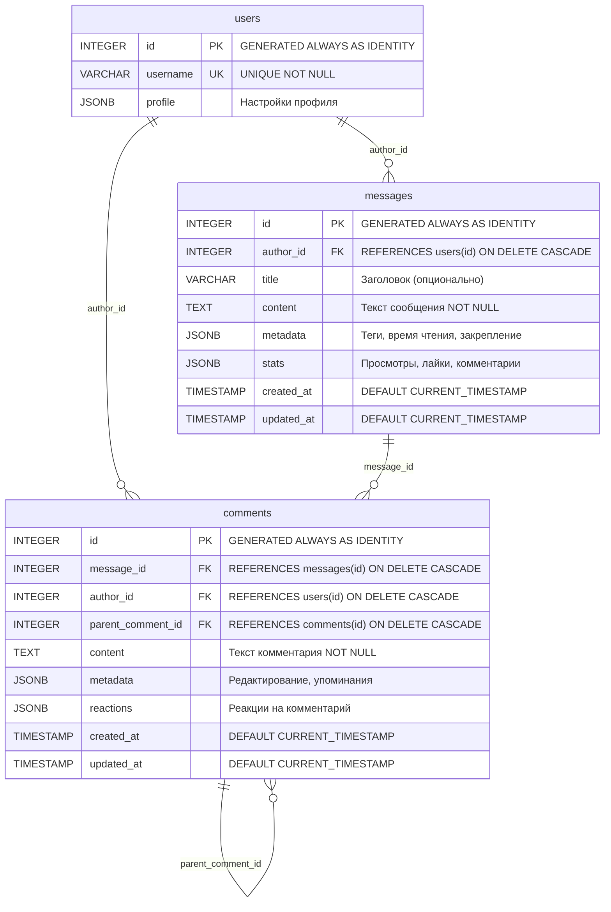

# Схема базы данных

## Сжатая схема

```
|- users
|--- id (INTEGER, PK, GENERATED ALWAYS AS IDENTITY)
|--- username (VARCHAR(100), UNIQUE, NOT NULL)
|--- profile (JSONB)
|
|- messages
|--- id (INTEGER, PK, GENERATED ALWAYS AS IDENTITY)
|--- author_id (INTEGER, FK → users.id, ON DELETE CASCADE)
|--- title (VARCHAR(200))
|--- content (TEXT, NOT NULL)
|--- metadata (JSONB)
|--- stats (JSONB)
|--- created_at (TIMESTAMP, DEFAULT CURRENT_TIMESTAMP)
|--- updated_at (TIMESTAMP, DEFAULT CURRENT_TIMESTAMP)
|
|- comments
|--- id (INTEGER, PK, GENERATED ALWAYS AS IDENTITY)
|--- message_id (INTEGER, FK → messages.id, ON DELETE CASCADE)
|--- author_id (INTEGER, FK → users.id, ON DELETE CASCADE)
|--- parent_comment_id (INTEGER, FK → comments.id, ON DELETE CASCADE)
|--- content (TEXT, NOT NULL)
|--- metadata (JSONB)
|--- reactions (JSONB)
|--- created_at (TIMESTAMP, DEFAULT CURRENT_TIMESTAMP)
|--- updated_at (TIMESTAMP, DEFAULT CURRENT_TIMESTAMP)
```

## ER-диаграмма



## Описание таблиц

### 1. `users` - Пользователи
Хранит информацию о пользователях мессенджера.

**Поля:**
- `id` (INTEGER, PK) - Уникальный идентификатор, автогенерируемый
- `username` (VARCHAR(100), UNIQUE, NOT NULL) - Уникальное имя пользователя
- `profile` (JSONB) - Настройки профиля в формате JSON:
  - `theme` - тема интерфейса (light/dark)
  - `notifications` - включены ли уведомления
  - `language` - язык интерфейса

**Связи:**
- Один пользователь может создать множество сообщений (`messages.author_id`)
- Один пользователь может создать множество комментариев (`comments.author_id`)

---

### 2. `messages` - Сообщения канала
Хранит сообщения, опубликованные в информационном канале мессенджера.

**Поля:**
- `id` (INTEGER, PK) - Уникальный идентификатор, автогенерируемый
- `author_id` (INTEGER, FK) - Ссылка на пользователя-автора сообщения
- `title` (VARCHAR(200)) - Заголовок сообщения (опционально)
- `content` (TEXT, NOT NULL) - Текст сообщения
- `metadata` (JSONB) - Дополнительные данные:
  - `tags` - массив тегов
  - `reading_time` - время чтения в минутах
  - `is_pinned` - закреплено ли сообщение
- `stats` (JSONB) - Статистика сообщения:
  - `views_count` - количество просмотров
  - `likes_count` - количество лайков
  - `comments_count` - количество комментариев
- `created_at` (TIMESTAMP) - Дата и время создания
- `updated_at` (TIMESTAMP) - Дата и время последнего обновления

**Связи:**
- Принадлежит одному пользователю (`users.id`)
- Может иметь множество комментариев (`comments.message_id`)

---

### 3. `comments` - Комментарии к сообщениям
Хранит комментарии пользователей к сообщениям канала. Поддерживает вложенные комментарии (ответы на комментарии).

**Поля:**
- `id` (INTEGER, PK) - Уникальный идентификатор, автогенерируемый
- `message_id` (INTEGER, FK) - Ссылка на сообщение, к которому относится комментарий
- `author_id` (INTEGER, FK) - Ссылка на пользователя-автора комментария
- `parent_comment_id` (INTEGER, FK, NULL) - Ссылка на родительский комментарий (для вложенных комментариев)
- `content` (TEXT, NOT NULL) - Текст комментария
- `metadata` (JSONB) - Дополнительные данные:
  - `is_edited` - был ли комментарий отредактирован
  - `mentions` - массив упоминаний пользователей
- `reactions` (JSONB) - Реакции на комментарий (лайки, любовь и т.д.)
- `created_at` (TIMESTAMP) - Дата и время создания
- `updated_at` (TIMESTAMP) - Дата и время последнего обновления

**Связи:**
- Принадлежит одному сообщению (`messages.id`)
- Принадлежит одному пользователю (`users.id`)
- Может иметь родительский комментарий (`comments.id`) - самоссылка для вложенности
- Может иметь дочерние комментарии (ответы)

---

## Правила каскадного удаления

Все внешние ключи настроены с `ON DELETE CASCADE`, что означает:
- При удалении пользователя удаляются все его сообщения и комментарии
- При удалении сообщения удаляются все комментарии к нему
- При удалении комментария удаляются все вложенные комментарии (ответы)

## Типы данных JSONB

### `users.profile`
```json
{
  "theme": "light" | "dark",
  "notifications": true | false,
  "language": "ru" | "en" | ...
}
```

### `messages.metadata`
```json
{
  "tags": ["tag1", "tag2", ...],
  "reading_time": 0,
  "is_pinned": false
}
```

### `messages.stats`
```json
{
  "views_count": 0,
  "likes_count": 0,
  "comments_count": 0
}
```

### `comments.metadata`
```json
{
  "is_edited": false,
  "mentions": ["username1", "username2", ...]
}
```

### `comments.reactions`
```json
{
  "like": 10,
  "love": 2,
  "laugh": 1,
  ...
}
```

